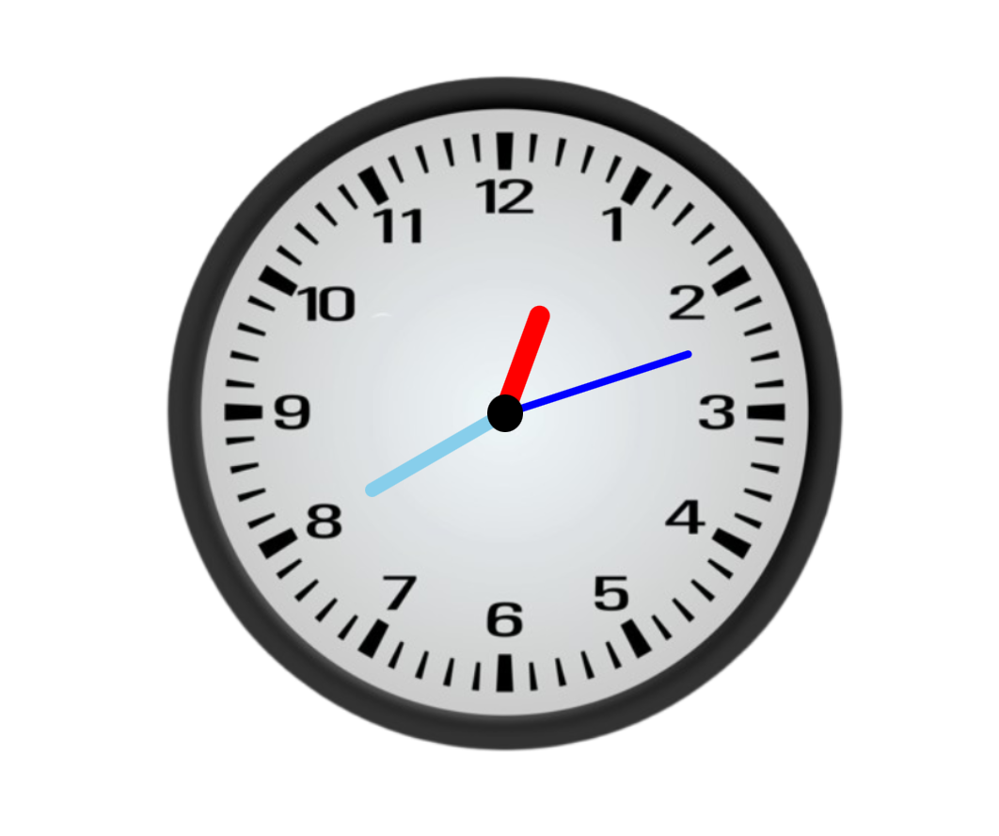

# ⏰ Analog Clock
---
An interactive analog clock built using **HTML, CSS, and JavaScript**.  
It visually represents the hour, minute, and second hands with accurate rotations based on real time.

---

## 🌐 Live Demo  
🔗 [Analog Clock](https://adityamahekar.github.io/Analog_clock/)
---
## 🔹 Formula Used

```bash
Hours hand:

12hrs -> 360 degree
1hr   -> 360/12 => 30 degree

For h hour => 30 * h + (m/2)

60 min -> 30 degree
1 min  -> (1/2) degree
m min  -> (m/2) degree [rotation]


Minutes hand:

60 min -> 360 degree
1 min  -> 6 degree
m min  -> 6 * m degree


Seconds hand:

60 sec -> 360 degree
1 sec  -> 6 degree
s sec  -> 6 * s degree
```

---
## 📷 Gallery

|Analog Clock|
|--------|
|  |
---
